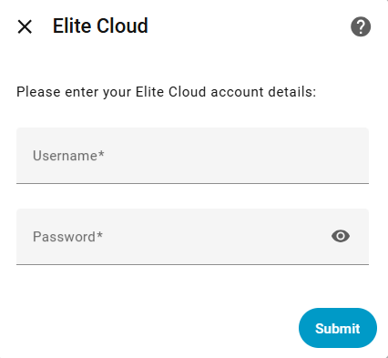
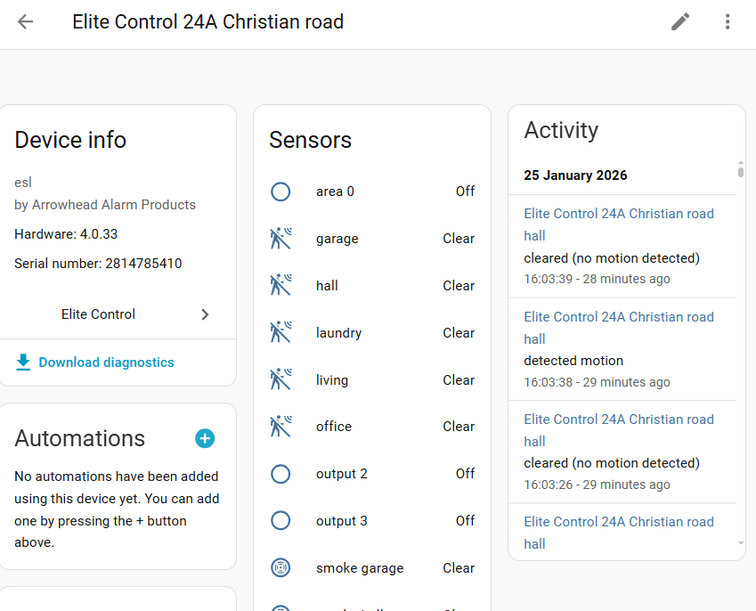

[](https://github.com/ankohanse/hass-elite-control)
[](https://github.com/custom-components/hacs)
[](https://github.com/ankohanse/hass-elite-control)<br/>
[](https://github.com/ankohanse/hass-elite-control/blob/main/LICENSE)
[](https://www.buymeacoffee.com/ankohanse)


# Elite Control

[Home Assistant](https://home-assistant.io/) Custom Integration for Arrowhead Alarm Systems ESL, ESL-2, Elite S and Elite S devices.
It is likely that other systems supported by the Elite Cloud app will function with this integration as well.

The custom integration is still a work-in-progress and currently only provides read-only entities. So status of area's, input's and output's of the device. But no methods yet to arm or disarm an area.

This component connects to the the Elite Cloud servers and automatically determines which devices are available there for the specified account.

There are several other Home Assistant integrations available for Arrowhead alarm systems, so make sure you choose the right one:
- [Elite Control](https://github.com/ankohanse/hass-elite-control): - This integration - For Elite Control (ESL, ESL-2, Elite S and Elite S) devices connected to Elite Cloud (via the Arrowhead IOT module).
- [Crow Runner](https://community.home-assistant.io/t/custom-component-crow-runner-arrowhead-aap-8-16-alarm-ip-module): For ESL devices via the older Arrowhead IP module using local connection.
- [AAP Alarm](https://github.com/osotechie/ha_aapalarm): For ESL devices via the RS232-BD or the older Arrowhead IP module (needs specific firmware version) using local connection.
- [Arrohead Alarm](https://github.com/thanoskas/arrowhead_alarm): version 2.x for ECi series, or version 1.x for Elite SX, both using local connection

# Prerequisites
This library depends on the backend servers for the Elite Cloud app to retrieve the device information from. 

Before using this library, the Elite Cloud app must have been used to link the alarm device to the Arrowhead Elite Cloud services.

## HACS
This custom integration is waiting to be included in HACS (Home Assistant Community Store) default integrations.
Until that time, you can add it as a HACS custom repository:
1. In the HACS page, press the three dots at the top right corner.
2. Select 'Custom Repositories'
3. Enter repository "https://github.com/ankohanse/hass-elite-control" (with the quotes seems to work better)
4. Select category 'integration' and press 'Add'
5. Restart Home Assistant.
6. Follow the UI based [Configuration](#configuration)

## Manual install
1. Under the `<config directory>/custom_components/` directory create a directory called `elitecontrol`. 
Copying all files in `/custom_components/elitecontrol/` folder from this repo into the new `<config directory>/custom_components/elitecontrol/` directory you just created.

    This is how your custom_components directory should look like:

    ```bash
    custom_components
    ├── elitecontrol
    │   ├── translations
    │   │   └── en.json
    │   ├── __init__.py
    │   ├── api.py
    │   ├── binary_sensor.py
    │   ├── config_flow.py
    │   ├── const.py
    │   ├── coordinator.py
    │   ├── data.py
    │   ├── diagnostics.py
    │   ├── entity.py
    │   ├── helper.py
    │   ├── manifest.json
    │   └── strings.json  
    ```

2. Restart Home Assistant.
3. Follow the UI based [Configuration](#configuration)

To start the setup of this custom integration:
- go to Home Assistant's Integration Dashboard
- Add Integration
- Search for 'Elite Control'
- Follow the prompts in the configuration step

## Step 1 - Connection details
The following properties are required to connect to the Elite Cloud servers:
- Username: email address as registered with Elite Cloud
- Password: password associated with the username
  


## Step 2 - Finish
The integration will try to connect to the Smart Water servers to retrieven the user's profile.
If this succeeds, it will create entities for the found gateways, tanks and pumps.


## Devices
After succcessful setup, all devices from the Smart Water profile should show up in a list.


On the individual device pages, the hardware related device information is displayed, together with sensors typically grouped into main entity sensors, controls and diagnostics.

Any sensors that you do not need can be manually disabled using the Home Assistant integration pages.



# Troubleshooting
Please set your logging for the this custom component to debug during initial setup phase. If everything works well, you are safe to remove the debug logging:

```yaml
logger:
  default: warn
  logs:
    custom_components.elitecontrol: debug
```